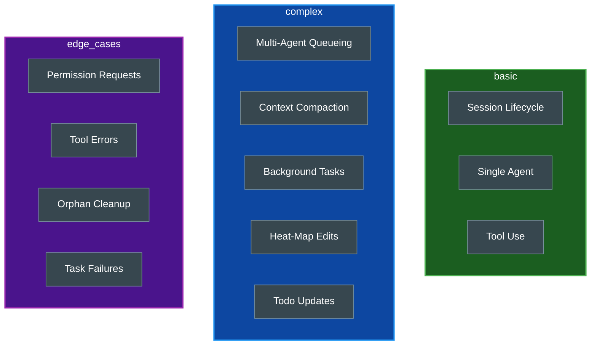

# Claude Office Scripts

Utility scripts for testing and demonstrating the Claude Office Visualizer without requiring live Claude Code sessions.

## Table of Contents

- [Overview](#overview)
- [Prerequisites](#prerequisites)
- [Available Scripts](#available-scripts)
- [Simulation Scenarios](#simulation-scenarios)
- [Single Agent Test](#single-agent-test)
- [Type Generation](#type-generation)
- [Running Scripts](#running-scripts)
- [Configuration](#configuration)
- [Related Documentation](#related-documentation)

## Overview

The scripts directory contains testing and development utilities:

- **Event Simulation**: Three scenarios exercising different frontend features
- **Pathfinding Debug**: Test agent navigation with single-agent scenarios
- **Type Generation**: Sync TypeScript types from Pydantic backend models
- **Demo Mode**: Showcase the visualizer without active Claude Code sessions

## Prerequisites

| Requirement | Purpose |
|-------------|---------|
| Python 3.13+ | Runtime |
| uv | Package management |
| Backend running | Event receiver at `localhost:8000` |
| Frontend running | Visualization at `localhost:3000` |

## Available Scripts

| Script | Purpose | Session ID |
|--------|---------|------------|
| `simulate_events.py` | Run simulation scenarios | `sim_session_123` (default) |
| `test_single_agent.py` | Debug pathfinding with one agent | `test_single_agent` |
| `gen_types.py` | Generate TypeScript from Pydantic models | N/A |

## Simulation Scenarios

The main simulation script supports three scenarios, each exercising different aspects of the visualizer.

### Scenario Comparison

| Scenario | Duration | Agents | Purpose |
|----------|----------|--------|---------|
| `basic` | ~60s | 1 | Minimal happy-path lifecycle |
| `complex` | ~5-10min | 4 | Full multi-agent workflow with compaction |
| `edge_cases` | ~2min | 1-2 | Error handling, permissions, cleanup |

### Features Tested by Scenario



### Basic Scenario

Simple agent spawn/complete cycle exercising the fundamental lifecycle:

1. Session starts
2. Boss receives user prompt
3. Boss reads a file and makes an edit
4. Single subagent spawns, does tool uses, completes
5. Session ends

### Complex Scenario

Full multi-agent workflow (default scenario):

1. Session starts at 35% context (compaction triggers during work)
2. Boss creates todo list and reads PRD
3. Boss makes file edits to seed heat-map
4. Four subagents spawn with staggered starts
5. Boss updates todos while agents work
6. Context compaction fires automatically at 80%
7. Background task notifications arrive
8. All todos marked complete, session ends

### Edge Cases Scenario

Unusual but valid sequences to verify error handling:

- **Permission Requests**: Boss and agent both hit permission blocks
- **Tool Errors**: Multiple tool failures incrementing error counter
- **Orphan Cleanup**: Subagent removed via CLEANUP without proper stop
- **Background Task Failure**: Failed task status in Remote Workers display
- **Long Prompts**: Prompt truncation in speech bubbles

### Background Task Notifications

The complex scenario sends 4 background task notifications:

| Task ID | Status | Summary |
|---------|--------|---------|
| `bg_task_a1b2c3d4` | completed | Linting codebase with ruff |
| `bg_task_e5f6g7h8` | completed | Running type checks with pyright |
| `bg_task_i9j0k1l2` | failed | Deploy to production failed |
| `bg_task_m3n4o5p6` | completed | Generated API documentation |

View these in the whiteboard by pressing `1` or `B` to switch to Remote Workers mode.

## Single Agent Test

A minimal script for debugging pathfinding and agent lifecycle.

### Test Sequence

```
Step 1: Session start
Step 2: Spawn agent at elevator (56, 190)
Step 3: Agent walks to boss slot (520, 868)
Step 4: Agent walks to desk 1 (256, 464) and works
Step 5: Agent completes work
Step 6: Agent walks to departure queue (760, 868) then elevator (86, 192)
Step 7: Session end
```

### Path Verification

The script prints expected positions to verify pathfinding:

```
Agent should spawn in elevator zone (first position: 56, 190)
Agent will queue for boss slot at (520, 868)
Path: boss slot -> corridor -> desk 1 (256, 464)
Path: desk -> corridor -> boss right slot (760, 868) -> elevator (86, 192)
```

## Type Generation

The `gen_types.py` script generates TypeScript interfaces from backend Pydantic models.

### What It Does

1. Imports all Pydantic models from `backend/app/models/`
2. Generates JSON schema with camelCase field names
3. Converts to TypeScript using `json-schema-to-typescript`
4. Outputs to `frontend/src/types/generated.ts`

### When to Run

Run this after modifying backend Pydantic models to keep frontend types in sync.

## Running Scripts

### From Project Root

```bash
# Run complex scenario (default)
make simulate

# Run specific scenario
uv run python scripts/simulate_events.py basic
uv run python scripts/simulate_events.py edge_cases

# Run with custom session ID
uv run python scripts/simulate_events.py complex --session my_session

# Run quietly (no progress output)
uv run python scripts/simulate_events.py basic --quiet

# Run single agent test
make test-agent

# Generate TypeScript types
make gen-types
```

### From Scripts Directory

```bash
cd scripts

# Run simulation
uv run python simulate_events.py basic
uv run python simulate_events.py complex
uv run python simulate_events.py edge_cases

# Single agent test
uv run python test_single_agent.py

# Generate types (must run from backend/)
cd ../backend && uv run python ../scripts/gen_types.py
```

### Via Backend API

The simulation can also be triggered via API:

```bash
curl -X POST http://localhost:8000/api/v1/sessions/simulate
```

Or click the **Simulate** button in the frontend header.

## Configuration

### Simulation Constants

Defined in `scripts/scenarios/_base.py`:

| Constant | Default | Description |
|----------|---------|-------------|
| `API_URL` | `http://localhost:8000/api/v1/events` | Backend endpoint |
| `MAX_CONTEXT_TOKENS` | `200000` | Simulated context limit |
| `COMPACTION_THRESHOLD` | `0.80` | Trigger at 80% |
| `COMPACTION_ANIMATION_DURATION` | `10` | Seconds for animation |

### Agent Names

Creative job titles used across all scenarios:

| Name | Name | Name |
|------|------|------|
| Scout | Fixer | Builder |
| Tester | Validator | Researcher |
| Debugger | Optimizer | Refactorer |
| Doc Writer | Type Ninja | Bug Hunter |
| Code Sage | Test Wizard | Lint Master |

### Task Descriptions

Realistic task descriptions for marquee display (sample):

- "Analyze authentication flow and identify security vulnerabilities in login module"
- "Refactor database queries to improve performance and reduce N+1 query issues"
- "Implement comprehensive unit tests for the payment processing service"

## Related Documentation

- [Project README](../README.md) - Project overview
- [Quick Start](../docs/QUICKSTART.md) - Getting started guide
- [Backend README](../backend/README.md) - Backend API details
- [Frontend README](../frontend/README.md) - Frontend visualization
